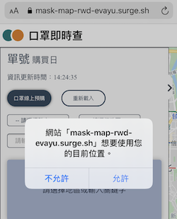
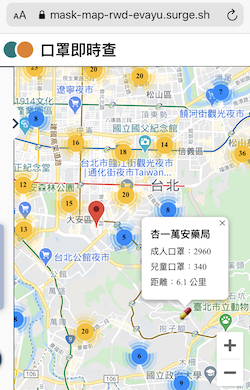
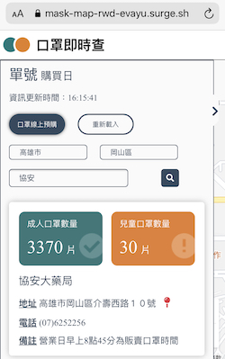

<h1>口罩地圖</h1>

<a href="https://mask-map-rwd-evayu.surge.sh/">地圖DEMO</a>

<a href="https://raw.githubusercontent.com/kiang/pharmacies/master/json/points.json">藥局、口罩數資料來源</a>

UI Credit: <a href="https://challenge.thef2e.com/user/3405?schedule=4432#works-4432">Penny Yang</a>

定位功能：<a href="https://developer.mozilla.org/zh-TW/docs/Web/API/Geolocation/Using_geolocation">Geolocation API</a>

地圖圖資：<a href="https://developers.google.com/maps/documentation/javascript/overview">Google Map API</a>

計算距離：
<a href="https://developers.google.com/maps/documentation/distance-matrix/overview">Google Distance MatrixAPI</a>

 
<h2>主要功能</h2>
<ol style="line-height: 2;">
  <li>使用者裝置定位</li>
  <li>於地圖上顯示藥局圖標</li>
  <li>呈現藥局列表與相關篩選功能</li>
  <li>計算選取藥局與使用者裝置距離</li>
</ol>
 

預設一開啟網頁時，會先抓取需要的藥局和口罩Data、載入地圖、取得使用者裝置位置等。

<h3>使用者裝置定位</h3>

  使用Web API提供的Geolocation物件，首先判斷使用者裝置是否支援此功能，不支援的話直接顯示視窗「您的裝置不支援定位功能」。
    
   如果支援Geolocation但要求被拒絕，則顯示「出現錯誤：定位失敗」；若成功取得使用者位置座標，則在地圖上放置紅色圖標。

 
<h3>顯示藥局圖標</h3>

  在取得所有藥局資訊後，將所有藥局的座標存入陣列並設定為圖標物件，但如果一次性將所有圖標放置在地圖上，
   
  不僅會因為資量太多載入困難，在瀏覽上也會過於密集，因此使用Google Maps API內有提供的
  <a href="https://developers.google.com/maps/documentation/javascript/marker-clustering"> Marker Clustering </a>
  功能，
   
  可以在縮小地圖時合理將數個圖標以集合的方式顯示。
   
  如果點選地圖上的藥局圖標(膠囊)，會用其座標去尋找對應藥局，並顯示資訊視窗在地圖上。

 
<h3>呈現藥局列表與相關篩選功能</h3>

  除了一般的select-option選單以外，還製作了簡單的關鍵字搜尋功能，可以搜尋地址或藥局名稱；這裡要注意，使用者沒有選擇縣市、只選擇縣市、選擇縣市及行政區後，被搜尋的標的是不同的。
   
  例如在沒有選擇縣市的情況下搜尋信義區，搜尋結果會包含臺北市及基隆市信義區中的藥局；但如果選擇了臺北市、再搜尋關鍵字「信義區」，結果列表中就不會出現位於基隆市信義區的藥局。

 
<h4>計算選取藥局和使用者裝置距離</h4>

  Google有提供Distance Matrix API，可以在輸入兩組座標的情況下計算兩點距離，如果有輸入移動方式(如開車)，也可以取得移動時間，非常方便好用。
   
  如果一開始沒有取得使用者裝置座標，就不會呼叫這個API；但如果有取得使用者座標的話，每點選一個藥局地址或圖標資訊，就會呼叫這個API計算距離，並顯示在地圖上的資訊視窗中。

